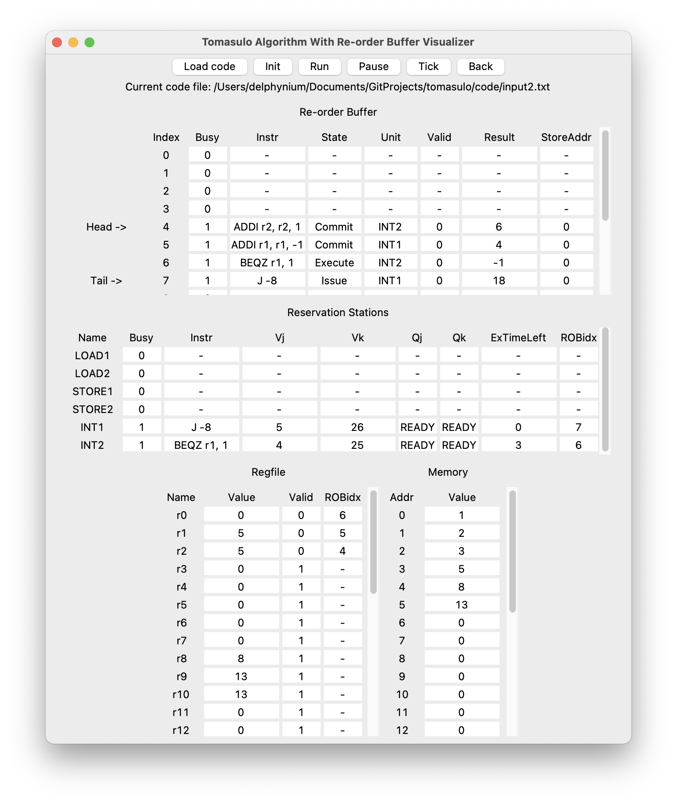

# Tomasulo 实验报告

## 1 算法部分

首先用 Python 做了一个简单的汇编器 `assembler.py` ，将实验用到的 MIPS 汇编语言译为机器码。

汇编器支持通过文件交互：`python assembler.py -i <input_file_path> -o <output_file_path>`，缺省参数则默认通过命令行交互。

汇编器实现得比较完备，不需要预扫描完整汇编代码，可以逐行汇编。遇到未定义的 tag 时，会先入队，等到定义 tag 的语句出现，一次性输出所有排队的指令。并且封装成了一个类 `Assembler`，因此可以很方便地被外部程序调用。

Tomasulo 算法部分基于 `template.c` 用 C++ 实现。

算法基本是参考课件 + 注释，向现有框架填入代码来实现的，主要变动有：

- 改进为带 ROB 的 Tomasulo 后，等待操作数的保留栈中不再记录正在计算该操作数的模块，而是记录 ROB index，而 0 是 index 的合法值，所以判定 `Vj`、`Vk` 有效的条件从对应的 Q = 0 改为 Q = -1；
- 无视一些结构冲突，比如两条指令同时向 CDB 上 write result、LOAD 和 STORE 模块同时操作相同地址。

 需要注意内存初始化为全 0，但 0 是合法指令 ADD r0, r0, r0，为防止 HALT 后的全 0 指令进入发射/执行 阶段，需要限定 pc 不能超过 `memorySize`，如果发现 pc 位于 `memorySize` 后，跳过发射阶段。框架的设计似乎是限定了代码段一定位于数据段后、内存的地址最高处，那么这样做是合理的。

## 2 GUI 部分

使用 Python Ctypes 技术栈做了 GUI，运行 `python gui.py` 即可使用。为此较大程度改写了 `template.c`，改写后的版本为 `tomasulo.c`，需要将其编译到 `./bin/libtomasulo.so` 以便 GUI 调用。因为该 GUI 并不只是一个播放器，与算法实际是同步执行的。

主要变动是所有控制机器状态转移的变量全部放进 `machineState` 结构体，然后将初始化 `machineState` 和在时钟下降沿进行一次状态转移的行为封装为函数，以便 Python 侧调用。

